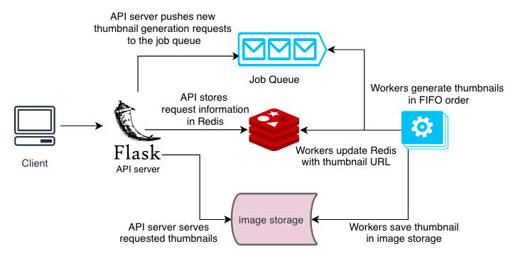
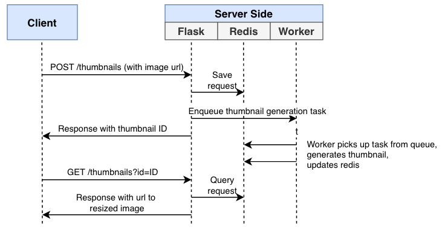

# Image Processing Service
The goal of this project was to create a JSON-based REST API service to resize images into 100x100px thumbnails.

To support a large number of requests, it uses queue-based workers to asynchronously generate the thumbnails. The client is able to poll the API to check the status of the generation and retrieve the URL of the generated thumbnail.

## Architecture & Design Decisions
This service's components are:
- A Flask API server that handles client requests to generate new thumbnails and retrieve old ones
- A Redis key-value store to serve as a database that captures request information
- A Redis job queue to enqueue new thumbnail generation requests for the workers
- Workers that read from the Redis job queue, generate thumbnails to an image storage location, and update the Redis key-value store
- Image storage (the API service can also serve thumbnails from this)



The Flask API offers versioning and its usage is very simple:
- GET `/v1/thumbnails?id=1` retrieves information about a given thumbnail (in this case, thumbnail with ID = 1)
- POST `/v1/thumbnails` submits a new image to be resized, identified by `url` in the POST body

API versioning can be done in different ways (e.g. URI versioning, custom request headers). I opted for the former, since it's a pretty common approach. Right now, it's currently set to a major version `/v1/resource`, but we could consider adding in minor versions as well.

When the API receives a request to resize an image, it enqueues that request onto a Redis job queue. Workers read off the queue and use [Pillow](https://github.com/python-pillow/Pillow) to resize the image. There are many Python libraries that offer image processing functionality, such as:
- [scikit-image](https://github.com/scikit-image/scikit-image) - 3.7k stars, 366 contributors
- [OpenCV](https://github.com/skvark/opencv-python)  - 1.3k stars, 20 contributors
- [PIL](http://www.pythonware.com/products/pil/) - discontinued and lacks Python 3 support

In this case, I decided to be pragmatic and choose Pillow. It's received a lot of positive feedback on StackOverflow and resizing an image into a 100x100px can be done in three lines of code:

```python
image = Image.open("mt_fuji.jpg")
image.thumbnail((100,100))
image.save("thumbnail.jpg")
```

When building such a system for production use, much more in-depth research should be done, alongside proper performance testing. For example, just looking at Pillow's [performance testing(https://python-pillow.org/pillow-perf/), there's a highly optimized downstream fork named [Pillow-SIMD](https://github.com/uploadcare/pillow-simd) that is both production-ready and comes with performance improvements.

Resize functionality can also be implemented using [different algorithms](https://uploadcare.com/blog/the-fastest-image-resize/) (e.g. fast nearest neighbour, convolution resampling). As a result, depending on our constraints (e.g. memory, CPU, execution time, photo quality), we'd want to look more in-depth at any library we're considering to understand the details of how it works and why it works the way. 

With respect to my choice of job queue, I decided on [Redis Queue](https://github.com/rq/rq) over [a handful of alternatives](https://www.fullstackpython.com/task-queues.html):
- [Celery](https://github.com/celery/celery) - most popular; supports both RabbitMQ and Redis as brokers
- [Huey](https://github.com/coleifer/huey) - a lightweight redis-based queue with flexible scheduling
- [Dramatiq](https://github.com/Bogdanp/dramatiq) - fast, reliable alternative to Celery with RabbitMQ/Redis as brokers.

Since each task queue offers its own set of features and functionality, it'd be worthwhile to do further research depending on our use case (and potential use cases) to determine the right one to use. In a real-life setting, it also may be worth prototyping a proof of concepts (POCs) with each one during the evaluation phase.

To be pragmatic for this project, I opted for Redis Queue given its claims on being simpler and more lightweight than Celery.

Once workers have generated the thumbnail, the image is saved onto a volume that is shared between the API server and the workers. This was a decision I made to be pragmatic and keep my implementation as simple as possible. As I later mention in the potential improvements, this approach won't scale and it'll make sense to look at alternative approaches (e.g. storing images on Amazon S3).

## API Request Flow
Below is a visual diagram of what a typical request may look like:

1. Client makes a POST request to generate a new thumbnail
2. The Flask API server stores the request information in Redis and enqueues it onto a Redis Queue
3. Available workers retrieve the request's information from Redis, generate a thumbnail, and update Redis
4. Client makes a GET request to retrieve the URL of the thumbnail

If needed, the client can poll the API endpoint and retrieve status of the thumbnail generation request.



## Potential Improvements
To keep this project small in scope, there are a few technical decisions I made wouldn't scale if we wanted to release this service in production. Some of the areas that are worth revisiting are:
- Validation and error handling. Currently, very little is being done so and a malicious actor could submit a URL to a very large file and cause the workers to crash.
- Depending on our needs for strong consistency or high availability, we'd most likely want to replace our Redis key-value store with something less transient and more durable.
- Depending on our read/write ratio of API requests, once we reach a certain scale where our database is hitting its limits, it may be fruitful to shard our database. For example, if our read/write ratio if 80/20, we may want to have a handful of read-only DBs and a single DB that allows writes.
- We currently store all resized thumbnails indefinitely in a folder that's shared between the workers and the API server. It would be worthwhile to look at storing the resized thumbnails somewhere else (e.g. Amazon S3, Google Cloud Storage) and maybe adding some sort of expiry on each thumbnail (e.g. 30 days). 
- We should consider adding API authentication, rate limiting, and throttling to prevent bad actors from abusing the system.
- Once we reach a certain volume of API requests, a single API server won't be able to handle the load. At that point, it may be worthwhile to scale the API server horizontally and potentially add a load balancer in front to distribute the load evenly.
- Depending on any SLAs that our service has committed to, we'll need to add metrics monitoring (e.g. Datadaog) so we can track various metrics (e.g. p99 time to generate a thumbnail) and be alerted if there is slowdown or our service is breaking our SLA.
- In the current implementation, a single queue is used. If we want to offer multiple priority levels, or perhaps offer high-priority for single requests and low-priority for batch requests, it would make sense to use multiple queues. We would also be able to scale up the workers per queue.

## How to Run Tests and Use
To build and start the project, from the project root:

```bash
$ docker build -t image_processor:latest . # build the Docker image from the Dockerfile
$ docker-compose up -d # start the rq_worker, redis, and api containers in the background
$ docker-compose logs -f # tail the logs
```

With the service now running, you can submit an image to be resized:
```bash
$ curl -X POST -H "Content-Type: application/json" -d '{"url": "https://images.pexels.com/photos/206359/pexels-photo-206359.jpeg"}' http://localhost:5000/v1/thumbnails
{"id":"96b725d0-14f5-48b7-b8b1-2182219fbf06","status":"queued","url":"https://images.pexels.com/photos/206359/pexels-photo-206359.jpeg"}
```

After, you can check the status of your thumbnail generation:
```bash
$ curl http://localhost:5000/v1/thumbnails?id=96b725d0-14f5-48b7-b8b1-2182219fbf06
{"url": "https://images.pexels.com/photos/206359/pexels-photo-206359.jpeg", "id": "96b725d0-14f5-48b7-b8b1-2182219fbf06", "status": "completed", "resized_url": "http://localhost:5000/static/96b725d0-14f5-48b7-b8b1-2182219fbf06.jpeg"}
```

To get started on local development:

1. Install requirements: `pip install -r requirements.txt`
2. Run tests: `python tests.py`
3. Start a local Redis server, `$ redis-server` and worker `$ rq worker`
4. Start the API server `$ flask run`